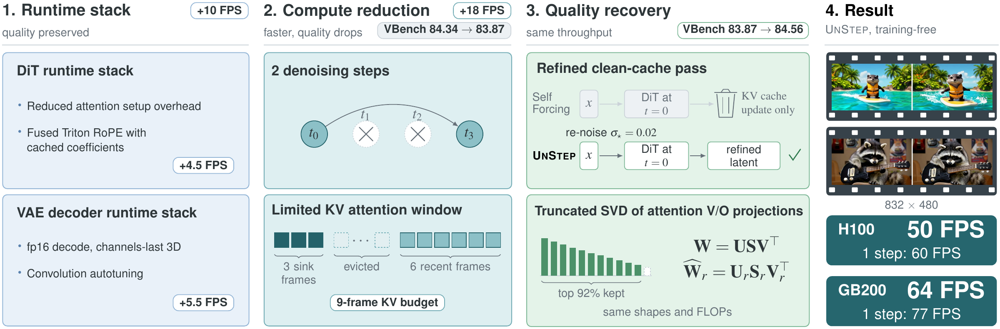
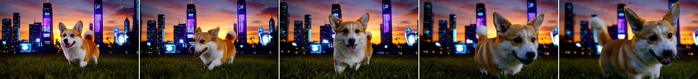
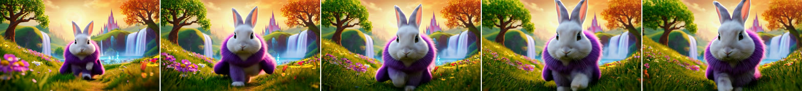

<h1 align="center">UnStep</h1>

<b>Training-Free Acceleration of Causal Video Diffusion</b>

  <b>50 FPS on a single H100 &nbsp; · &nbsp; 64 FPS on GB200</b> 
  Default two-step wrapper &nbsp; · &nbsp; 832 × 480 &nbsp; · &nbsp; No retraining 
  One step: 60 FPS on H100 and 77 FPS on GB200. Speeds rounded as in the paper.

UnStep accelerates existing Self Forcing and Causal Forcing checkpoints at inference. It combines fewer denoising steps and a smaller KV attention window with clean-cache refinement, truncated SVD, and an optimized DiT/VAE runtime stack.

## Method

## Start here

Each folder contains its own instructions and relevant files. Start with installation, then generation and evaluation.

| Task | Where to go |
| --- | --- |
| Install dependencies and download models and prompts | [installation/](installation/) |
| Generate videos | [generation/](generation/) |
| Evaluate with VBench | [evaluation/](evaluation/) |
| Measure speed and run ablations | [benchmarks/](benchmarks/) |
| Run correctness checks | [tests/](tests/) |

## Samples

Selected frames from five-second videos generated by **Self Forcing + UnStep**, using the default two-step wrapper.

**A corgi in a cyberpunk park**

**A rabbit exploring a fantasy landscape**

**A raccoon playing guitar in a boat**

## Acknowledgments

UnStep builds on [Self Forcing](https://github.com/guandeh17/Self-Forcing), including its Wan2.1 implementation, and uses [VBench](https://github.com/Vchitect/VBench) for evaluation. We thank their authors for releasing their code. Code attribution and licenses are listed in [THIRD_PARTY_NOTICES.md](THIRD_PARTY_NOTICES.md).

## Contributing

See [CONTRIBUTING.md](CONTRIBUTING.md) and our [Code of Conduct](CODE_OF_CONDUCT.md).

## License

[CC BY-NC 4.0](LICENSE). Third-party code and model weights retain their own licenses.
